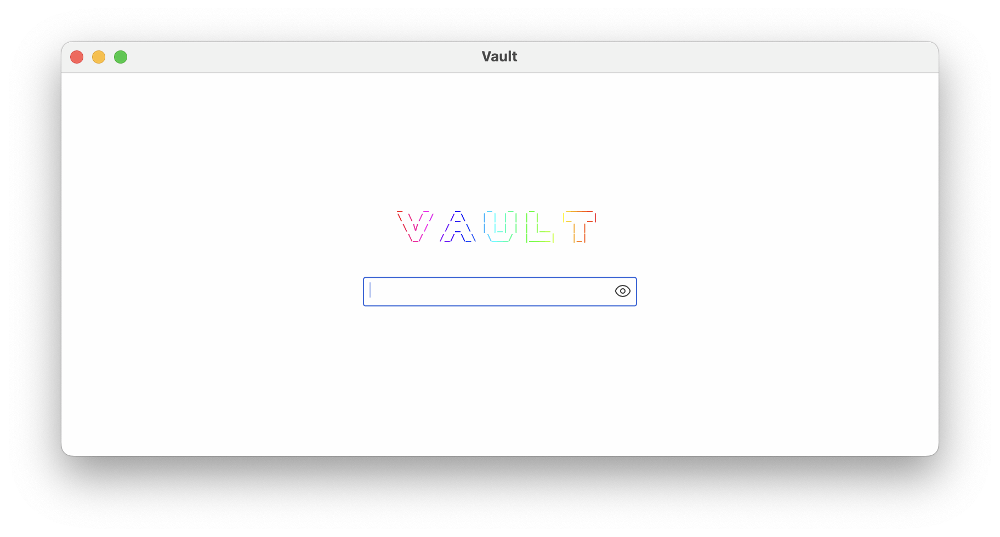

# VAULT

– In active development, not ready yet for production –

Vault is a simple cross-platform password manager built in pure rust and
utilizing [floem](https://github.com/lapce/floem) for the UI.

### How to try it
```
git clone https://github.com/dominikwilkowski/vault.git
cd vault
cargo run
```
### Configuration
Both the password database and configuration are in `vault_config.toml` currently
this is stored in the current working directory. If one does not exist it will be
created.  

### Screenshots



## License
Copyleft (c) 2023
Licensed under the [GNU GPL-3.0-or-later](https://github.com/dominikwilkowski/vault/blob/main/LICENSE).
